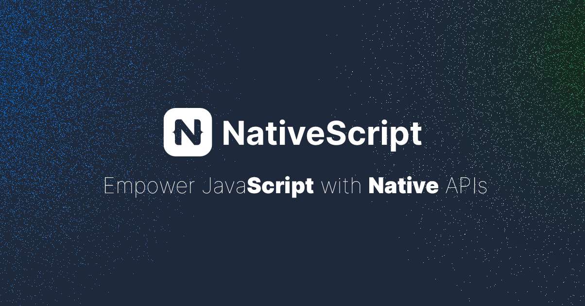

[](https://nativescript.org)

<p>

  [](https://github.com/NativeScript/NativeScript/actions/workflows/apps_automated_android.yml)
  [](https://github.com/NativeScript/NativeScript/actions/workflows/apps_automated_ios.yml)
  [](https://github.com/NativeScript/NativeScript/blob/main/LICENSE)
  [](https://www.npmjs.com/@nativescript/core)
  [](https://nativescript.org/discord)
  [](https://app.fossa.com/projects/git%2Bgithub.com%2FNativeScript%2FNativeScript?ref=badge_shield)
  [](https://nativescript.org)
  [](https://good-labs.github.io/greater-good-affirmation)
  [](https://opencollective.com/NativeScript)

</p>

[NativeScript](http://www.nativescript.org) empowers you to access native APIs from JavaScript directly. Currently iOS, Android, and visionOS runtimes are provided for rich mobile development across a variety of diverse use cases.


[](https://app.fossa.com/projects/git%2Bgithub.com%2FNativeScript%2FNativeScript?ref=badge_large)

## ✨ Features

- **Cross-Platform Development**: Build truly native mobile apps for iOS, Android, and visionOS using JavaScript/TypeScript
- **Native API Access**: Directly access all native platform APIs from JavaScript
- **Framework Agnostic**: Works with Angular, React, Vue, Svelte, or plain JavaScript/TypeScript
- **Native UI Components**: Use native UI components for maximum performance
- **Hot Module Replacement**: See changes instantly with HMR during development
- **Rich Plugin Ecosystem**: Extend functionality with community plugins
- **TypeScript Support**: First-class TypeScript support out of the box
- **CSS Styling**: Style your apps with CSS or SASS/SCSS
- **CLI Tools**: Powerful command-line interface for development workflow

## 🚀 Quick Start

### Prerequisites

- Node.js (LTS version recommended)
- npm (comes with Node.js) or yarn
- For iOS development: Xcode and CocoaPods (macOS only)
- For Android development: Android Studio and Android SDK

### UI Customization

#### SearchBar Clear Button Color

You can customize the clear button ("X") color in a SearchBar using platform-specific CSS:

```xml
<SearchBar hint="Search..." class="my-search-bar" />
```

```css
/* For iOS */
SearchBar.ios .search-bar-clear-icon {
    color: #FF0000; /* Red color for the clear button */
}

/* For Android */
SearchBar.android .search-bar-clear-icon {
    tint-color: #FF0000; /* Red color for the clear button */
}
```

Alternatively, you can set it programmatically:

```typescript
// For iOS
if (isIOS) {
    const searchBar = page.getViewById('mySearchBar');
    const clearButton = searchBar.ios.searchBar.searchField.clearButton;
    clearButton.tintColor = new Color('red').ios;
}

// For Android
if (isAndroid) {
    const searchBar = page.getViewById('mySearchBar');
    const searchCloseIcon = searchBar.android.findViewById(androidx.appcompat.R.id.search_close_btn);
    if (searchCloseIcon) {
        searchCloseIcon.setColorFilter(
            new Color('red').android,
            android.graphics.PorterDuff.Mode.SRC_IN
        );
    }
}
```

### CSS Properties

NativeScript supports additional CSS properties for fine-grained control over view transformations:

```css
.my-view {
  /* Control the x and y origin for transformations */
  origin-x: 50%;  /* Can be percentage, px, or other length units */
  origin-y: 50%;  /* Can be percentage, px, or other length units */
  
  /* Example with transform */
  transform: rotate(45deg);  /* Rotation will be around the specified origin */
}
```

### Installation

1. **Install the NativeScript CLI globally:**
   ```bash
   npm install -g nativescript
   ```

2. **Verify installation:**
   ```bash
   ns --version
   ```

3. **Create a new project:**
   ```bash
   ns create my-app
   # Follow the prompts to choose your preferred template (Angular, React, Vue, etc.)
   ```

4. **Navigate into your project directory:**
   ```bash
   cd my-app
   ```

5. **Run your app on an emulator or device:**
   ```bash
   # For Android
   ns run android
   
   # For iOS (macOS only)
   ns run ios
   ```

## 🏗️ Project Structure

A typical NativeScript project structure looks like this:

```
my-app/
├── app/                     # Your application code
│   ├── app.(css|scss)       # Global styles
│   ├── app.(js|ts)          # Application entry point
│   ├── main-page.(xml|html) # Main page
│   └── ...
├── App_Resources/          # Platform-specific resources
│   ├── Android/            # Android resources
│   └── iOS/                # iOS resources
├── node_modules/           # Dependencies
├── platforms/              # Platform-specific builds
├── package.json            # Project configuration
└── webpack.config.js       # Webpack configuration
```

## 🧪 Running Tests

NativeScript provides a robust testing environment. To run tests:

```bash
# Install testing dependencies
npm install --save-dev @nativescript/core @nativescript/angular @nativescript/webpack

# Run tests
npm test
```

For more advanced testing scenarios, check out the [testing documentation](https://docs.nativescript.org/tooling/testing).

## Contribute

1. [Setup your local development environment](https://docs.nativescript.org/setup/)

2. Clone to contribute:

```bash
$ git clone https://github.com/NativeScript/NativeScript.git
$ cd NativeScript

# setup workspace for development
$ npm run setup

# list all available commands to run
$ npm start
```

We love you and your pull requests 🤗. Please follow our [contributing guide](https://github.com/NativeScript/NativeScript/blob/main/tools/notes/CONTRIBUTING.md) and see [our code of governance](https://github.com/NativeScript/management/blob/master/nativescript-governance.md) to become as involved as you want to be.

## @nativescript/*

- [@nativescript/core](https://github.com/NativeScript/NativeScript/tree/main/packages/core)
  Singular primitives offering an easy-to-use API surface for diverse iOS/visionOS/Android APIs implemented with NativeScript.
- [@nativescript/types](https://github.com/NativeScript/NativeScript/tree/main/packages/types)
  Types for both iOS/Android below wrapped up as a convenience. *Most commonly used.*
- [@nativescript/types-ios](https://github.com/NativeScript/NativeScript/tree/main/packages/types-ios)
  Types for iOS.
- [@nativescript/types-android](https://github.com/NativeScript/NativeScript/tree/main/packages/types-android)
  Types for Android.
- [@nativescript/types-minimal](https://github.com/NativeScript/NativeScript/tree/main/packages/types-minimal)
  A very minimal set of types for only the latest Android and iOS sdks. Most commonly used to optimize Web-based IDE's which auto load all type declarations from node_modules.
- [@nativescript/ui-mobile-base](https://github.com/NativeScript/NativeScript/tree/main/packages/ui-mobile-base)
  UI mobile base native classes used by core.
- [@nativescript/webpack](https://github.com/NativeScript/NativeScript/tree/main/packages/webpack5)
  Webpack build utilities and configs used by NativeScript apps.

## 🌟 Community and Support

- Join our [Discord community](https://nativescript.org/discord) for real-time discussions
- Follow [@NativeScript](https://twitter.com/NativeScript) on Twitter for updates
- Check out [Stack Overflow](https://stackoverflow.com/questions/tagged/nativescript) for community Q&A
- Report issues on [GitHub Issues](https://github.com/NativeScript/NativeScript/issues)
- Contribute to the [documentation](https://github.com/NativeScript/docs)

## 🔗 Quick Links

- [NativeScript Home](https://nativescript.org)
- [NativeScript Tutorials](https://docs.nativescript.org/tutorials/)
- [NativeScript documentation](https://docs.nativescript.org/)
- JavaScript starter: https://nativescript.new/javascript
- TypeScript starter: https://nativescript.new/typescript
- Angular starter: https://nativescript.new/angular
- React starter: https://nativescript.new/react
- Solid starter: https://nativescript.new/solid
- Svelte starter: https://nativescript.new/svelte
- Vue starter: https://nativescript.new/vue
- Vue 3 starter: https://nativescript.new/vue3
- [NativeScript on Twitter](http://twitter.com/NativeScript)
- [NativeScript on Discord](https://nativescript.org/discord)
- [NativeScript on Stack Overflow](http://stackoverflow.com/questions/tagged/nativescript)

## Other source repos

Outside the source centralized in this repo, NativeScript consists of a few other source repos. Here are the major ones:

- [iOS and visionOS Runtime](https://github.com/NativeScript/ios)
	Empowers JavaScript code to be executed on iOS and visionOS devices written in a mix of C++, Objective-C, and Swift.
- [Android Runtime](https://github.com/NativeScript/android)
	Empowers JavaScript code to be executed on Android devices written in a mix of C++, Java and Kotlin.
- [CLI](https://github.com/NativeScript/nativescript-cli)
	Command-line interface empowering you to create, build, and run apps using NativeScript.
- [Docs](https://github.com/NativeScript/docs)
	Documentation available at <http://docs.nativescript.org/> written in Markdown.
- [Plugins](https://github.com/NativeScript/plugins)
  Various TSC managed plugins. Also a good reference is the [plugin marketplace](https://market.nativescript.org/) with several additional plugins.
- [Firebase](https://github.com/NativeScript/firebase)
  Modular Firebase 🔥 implementation for supported platforms.
- [ML Kit](https://github.com/NativeScript/mlkit)
  Google's [ML Kit SDKs for supported platforms](https://developers.google.com/ml-kit).
- [Payments](https://github.com/NativeScript/payments)
  In-App Purchase, Subscriptions, Google Pay and Apple Pay.
- [Artwork](https://github.com/NativeScript/artwork)
  Want to use our logo or colors? Feel free to use any of our ready-to-use media material.

## Copyright notice

Copyright [OpenJS Foundation](https://openjsf.org) and `NativeScript` contributors. All rights reserved. The [OpenJS Foundation](https://openjsf.org) has registered trademarks and uses trademarks.  For a list of trademarks of the [OpenJS Foundation](https://openjsf.org), please see our [Trademark Policy](https://trademark-policy.openjsf.org/) and [Trademark List](https://trademark-list.openjsf.org/).  Trademarks and logos not indicated on the [list of OpenJS Foundation trademarks](https://trademark-list.openjsf.org) are trademarks™ or registered® trademarks of their respective holders. Use of them does not imply any affiliation with or endorsement by them.

[The OpenJS Foundation](https://openjsf.org/) | [Terms of Use](https://terms-of-use.openjsf.org/) | [Privacy Policy](https://privacy-policy.openjsf.org/) | [OpenJS Foundation Bylaws](https://bylaws.openjsf.org/) | [Trademark Policy](https://trademark-policy.openjsf.org/) | [Trademark List](https://trademark-list.openjsf.org/) | [Cookie Policy](https://www.linuxfoundation.org/cookies/)

<h3 align="center">Made with ❤️</h3>
