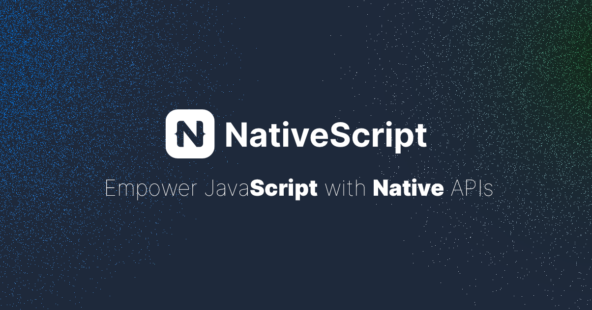

[](https://nativescript.org)

<p>

  [](https://github.com/NativeScript/NativeScript/actions/workflows/apps_automated_android.yml)
  [](https://github.com/NativeScript/NativeScript/actions/workflows/apps_automated_ios.yml)
  [](https://github.com/NativeScript/NativeScript/blob/main/LICENSE)
  [](https://www.npmjs.com/@nativescript/core)
  [](https://nativescript.org/discord)
  [](https://app.fossa.com/projects/git%2Bgithub.com%2FNativeScript%2FNativeScript?ref=badge_shield)
  [](https://nativescript.org)
  [](https://good-labs.github.io/greater-good-affirmation)
  [](https://opencollective.com/NativeScript)

</p>

[NativeScript](http://www.nativescript.org) empowers you to access native APIs from JavaScript directly. Currently iOS, Android, and visionOS runtimes are provided for rich mobile development across a variety of diverse use cases.


[](https://app.fossa.com/projects/git%2Bgithub.com%2FNativeScript%2FNativeScript?ref=badge_large)

## Quick Start

To get started with NativeScript, follow these steps:

1.  **Install the NativeScript CLI globally:**
    ```bash
    npm install -g nativescript
    ```

2.  **Create a new project:**
    ```bash
    ns create my-app
    ```

3.  **Navigate into your project directory:**
    ```bash
    cd my-app
    ```

4.  **Run your app on an emulator or device:**
    ```bash
    ns run android
    ```
    or
    ```bash
    ns run ios
    ```

## Contribute

1. [Setup your local development environment](https://docs.nativescript.org/setup/)

2. Clone to contribute:

```bash
$ git clone https://github.com/NativeScript/NativeScript.git
$ cd NativeScript

# setup workspace for development
$ npm run setup

# list all available commands to run
$ npm start
```

We love you and your pull requests 🤗. Please follow our [contributing guide](https://github.com/NativeScript/NativeScript/blob/main/tools/notes/CONTRIBUTING.md) and see [our code of governance](https://github.com/NativeScript/management/blob/master/nativescript-governance.md) to become as involved as you want to be.

## @nativescript/*

- [@nativescript/core](https://github.com/NativeScript/NativeScript/tree/main/packages/core)
  Singular primitives offering an easy-to-use API surface for diverse iOS/visionOS/Android APIs implemented with NativeScript.
- [@nativescript/types](https://github.com/NativeScript/NativeScript/tree/main/packages/types)
  Types for both iOS/Android below wrapped up as a convenience. *Most commonly used.*
- [@nativescript/types-ios](https://github.com/NativeScript/NativeScript/tree/main/packages/types-ios)
  Types for iOS.
- [@nativescript/types-android](https://github.com/NativeScript/NativeScript/tree/main/packages/types-android)
  Types for Android.
- [@nativescript/types-minimal](https://github.com/NativeScript/NativeScript/tree/main/packages/types-minimal)
  A very minimal set of types for only the latest Android and iOS sdks. Most commonly used to optimize Web-based IDE's which auto load all type declarations from node_modules.
- [@nativescript/ui-mobile-base](https://github.com/NativeScript/NativeScript/tree/main/packages/ui-mobile-base)
  UI mobile base native classes used by core.
- [@nativescript/webpack](https://github.com/NativeScript/NativeScript/tree/main/packages/webpack5)
  Webpack build utilities and configs used by NativeScript apps.

## Quick Links

- [NativeScript Home](https://nativescript.org)
- [NativeScript Tutorials](https://docs.nativescript.org/tutorials/)
- [NativeScript documentation](https://docs.nativescript.org/)
- JavaScript starter: https://nativescript.new/javascript
- TypeScript starter: https://nativescript.new/typescript
- Angular starter: https://nativescript.new/angular
- React starter: https://nativescript.new/react
- Solid starter: https://nativescript.new/solid
- Svelte starter: https://nativescript.new/svelte
- Vue starter: https://nativescript.new/vue
- Vue 3 starter: https://nativescript.new/vue3
- [NativeScript on Twitter](http://twitter.com/NativeScript)
- [NativeScript on Discord](https://nativescript.org/discord)
- [NativeScript on Stack Overflow](http://stackoverflow.com/questions/tagged/nativescript)

## Other source repos

Outside the source centralized in this repo, NativeScript consists of a few other source repos. Here are the major ones:

- [iOS and visionOS Runtime](https://github.com/NativeScript/ios)
	Empowers JavaScript code to be executed on iOS and visionOS devices written in a mix of C++, Objective-C, and Swift.
- [Android Runtime](https://github.com/NativeScript/android)
	Empowers JavaScript code to be executed on Android devices written in a mix of C++, Java and Kotlin.
- [CLI](https://github.com/NativeScript/nativescript-cli)
	Command-line interface empowering you to create, build, and run apps using NativeScript.
- [Docs](https://github.com/NativeScript/docs)
	Documentation available at <http://docs.nativescript.org/> written in Markdown.
- [Plugins](https://github.com/NativeScript/plugins)
  Various TSC managed plugins. Also a good reference is the [plugin marketplace](https://market.nativescript.org/) with several additional plugins.
- [Firebase](https://github.com/NativeScript/firebase)
  Modular Firebase 🔥 implementation for supported platforms.
- [ML Kit](https://github.com/NativeScript/mlkit)
  Google's [ML Kit SDKs for supported platforms](https://developers.google.com/ml-kit).
- [Payments](https://github.com/NativeScript/payments)
  In-App Purchase, Subscriptions, Google Pay and Apple Pay.
- [Artwork](https://github.com/NativeScript/artwork)
  Want to use our logo or colors? Feel free to use any of our ready-to-use media material.

## Copyright notice

Copyright [OpenJS Foundation](https://openjsf.org) and `NativeScript` contributors. All rights reserved. The [OpenJS Foundation](https://openjsf.org) has registered trademarks and uses trademarks.  For a list of trademarks of the [OpenJS Foundation](https://openjsf.org), please see our [Trademark Policy](https://trademark-policy.openjsf.org/) and [Trademark List](https://trademark-list.openjsf.org/).  Trademarks and logos not indicated on the [list of OpenJS Foundation trademarks](https://trademark-list.openjsf.org) are trademarks™ or registered® trademarks of their respective holders. Use of them does not imply any affiliation with or endorsement by them.

[The OpenJS Foundation](https://openjsf.org/) | [Terms of Use](https://terms-of-use.openjsf.org/) | [Privacy Policy](https://privacy-policy.openjsf.org/) | [OpenJS Foundation Bylaws](https://bylaws.openjsf.org/) | [Trademark Policy](https://trademark-policy.openjsf.org/) | [Trademark List](https://trademark-list.openjsf.org/) | [Cookie Policy](https://www.linuxfoundation.org/cookies/)

<h3 align="center">Made with ❤️</h3>


## 🌐 Web Resources & Interactive Index
- [RAGDOLL ARENA 2 PLAYER](https://welearnaction.onrender.com/ragdoll-arena-2-player.html)
- [CATEGORY BRAIN261](https://learnaction.netlify.app/category-brain261.html)
- [ONLINE PORTAL](https://ilearnworlds.web.app/)
- [SITEMAP](https://iskillquest.pages.dev/sitemap.html)
- [ONLINE PORTAL](https://themindplaying.web.app/)
- [SITEMAP](https://themindplaying.web.app/sitemap.html)
- [ONLINE PORTAL](https://ilearnworldkr.pages.dev/)
- [CATEGORY MANAGEMENT210](https://learnaction.netlify.app/category-management210.html)
- [SITEMAP](https://ilearnworldjp.pages.dev/sitemap.html)
- [CATEGORY MYSTERY45](https://learnaction.netlify.app/category-mystery45.html)
- [CATEGORY MAKEUP](https://learnaction.netlify.app/category-makeup.html)
- [CATEGORY HORROR 2](https://learnaction.netlify.app/category-horror-2.html)
- [TERMS](https://studyquests.github.io/terms.html)
- [CATEGORY MAKEUP CATEGORY](https://learnaction.netlify.app/category-makeup-category.html)
- [SITEMAP](https://studyquests.github.io/sitemap.html)
- [INDEX20](https://learnaction.netlify.app/index20.html)
- [CATEGORY 3D1 371](https://learnaction.netlify.app/category-3d1-371.html)
- [SLINGSHOT MASTER](https://learnaction.netlify.app/slingshot-master.html)
- [CATEGORY AGILITY](https://learnaction.netlify.app/category-agility.html)
- [ONLINE PORTAL](https://iskillcrafts.web.app/)
- [CATEGORY ZOMBIE175](https://learnaction.netlify.app/category-zombie175.html)
- [FOONO ONLINE MULTIPLAYER CARD GAME](https://learnaction.netlify.app/foono-online-multiplayer-card-game.html)
- [ONLINE PORTAL](https://quizverses.pages.dev/)
- [WHEEL OF BINGO](https://learnaction.netlify.app/wheel-of-bingo.html)
- [SPIDER EVOLUTION](https://learnaction.netlify.app/spider-evolution.html)
- [TEACHER SIMULATOR CHRISTMAS EXAM](https://learnaction.netlify.app/teacher-simulator-christmas-exam.html)
- [SITEMAP](https://cryptotify.github.io/sitemap.html)
- [CUT N FILL](https://learnaction.netlify.app/cut-n-fill.html)
- [SITEMAP](https://studyquests.pages.dev/sitemap.html)
- [FLOWER SORT](https://learnaction.netlify.app/flower-sort.html)
- [CATEGORY BALL173](https://learnaction.netlify.app/category-ball173.html)
- [CATEGORY GUN238](https://learnaction.netlify.app/category-gun238.html)
- [FIGHT TO THE END](https://learnaction.netlify.app/fight-to-the-end.html)
- [CATEGORY TETRIS36](https://learnaction.netlify.app/category-tetris36.html)
- [CATEGORY THINKY](https://learnaction.netlify.app/category-thinky.html)
- [ROBLOX HALLOWEEN COSTUME PARTY](https://learnaction.netlify.app/roblox-halloween-costume-party.html)
- [SCARY BABY YELLOW GAME](https://learnaction.netlify.app/scary-baby-yellow-game.html)
- [ONLINE PORTAL](https://themindzone.pages.dev/)
- [CHRISTMAS SNOWBALL ARENA](https://learnaction.netlify.app/christmas-snowball-arena.html)
- [VSCO GIRL AESTHETIC](https://learnaction.netlify.app/vsco-girl-aesthetic.html)
- [ONLINE PORTAL](https://ptskillcrafts.pages.dev/)
- [MINI GAMES RELAX COLLECTION 2](https://learnaction.netlify.app/mini-games-relax-collection-2.html)
- [WILD HUNTING CLASH](https://learnaction.netlify.app/wild-hunting-clash.html)
- [EASTER EGGVENTURE](https://learnaction.netlify.app/easter-eggventure.html)
- [PIRATES MATCH THE LOST TREASURE](https://learnaction.netlify.app/pirates-match-the-lost-treasure.html)
- [MAGIC PRINCESS DRESS UP DOLL](https://learnaction.netlify.app/magic-princess-dress-up-doll.html)
- [ROOM SORT FLOOR PLAN](https://learnaction.netlify.app/room-sort-floor-plan.html)
- [CATEGORY BATTLE524](https://learnaction.netlify.app/category-battle524.html)
- [OUTSIDE](https://learnaction.netlify.app/outside.html)
- [BONNIE FITNESS FRENZY](https://learnaction.netlify.app/bonnie-fitness-frenzy.html)
- [CATEGORY THINKY 2](https://learnaction.netlify.app/category-thinky-2.html)
- [STICKHOLEIO](https://learnaction.netlify.app/stickholeio.html)
- [BLOCK PUZZLE TRAVEL](https://learnaction.netlify.app/block-puzzle-travel.html)
- [CATEGORY ART](https://welearnaction.onrender.com/category-art.html)
- [RAGDOLL JUMP](https://welearnaction.onrender.com/ragdoll-jump.html)
- [VORTEX BALL](https://learnaction.netlify.app/vortex-ball.html)
- [CATEGORY HERO72](https://welearnaction.onrender.com/category-hero72.html)
- [MERRY CHRISTMAS STICKMAN](https://learnaction.netlify.app/merry-christmas-stickman.html)
- [CATEGORY PUZZLE 2](https://welearnaction.onrender.com/category-puzzle-2.html)
- [CATEGORY CASUAL 7](https://welearnaction.onrender.com/category-casual-7.html)
- [CATEGORY MAGIC46](https://welearnaction.onrender.com/category-magic46.html)
- [CATEGORY ARCHERY52](https://learnaction.netlify.app/category-archery52.html)
- [HAMSTERCYCLE](https://learnaction.netlify.app/hamstercycle.html)
- [PRIVACY](https://quizverses-9d2f2.web.app/privacy.html)
- [TERMS](https://studyplayings.pages.dev/terms.html)
- [EGG DASH](https://learnaction.netlify.app/egg-dash.html)
- [CATEGORY BUILDING](https://welearnaction.onrender.com/category-building.html)
- [ZOMBIE SPACE EPISODE II](https://learnaction.netlify.app/zombie-space-episode-ii.html)
- [INDEX8](https://welearnaction.onrender.com/index8.html)
- [ROBBIE BECOME A BEAST](https://learnaction.netlify.app/robbie-become-a-beast.html)
- [ONLINE PORTAL](https://themindplay.pages.dev/)
- [MASK EVOLUTION 3D](https://learnaction.netlify.app/mask-evolution-3d.html)
- [TERMS](https://brainquests.netlify.app/terms.html)
- [SCREW NUTS BOLTS WOOD SOLVE](https://learnaction.netlify.app/screw-nuts-bolts-wood-solve.html)
- [CATEGORY SIMULATION 3](https://welearnaction.onrender.com/category-simulation-3.html)
- [INDEX21](https://welearnaction.onrender.com/index21.html)
- [INDEX7](https://welearnaction.onrender.com/index7.html)
- [CATEGORY CASUAL 6](https://learnaction.netlify.app/category-casual-6.html)
- [JELI2D](https://learnaction.netlify.app/jeli2d.html)
- [CATEGORY PIXEL313](https://welearnaction.onrender.com/category-pixel313.html)
- [CATEGORY LOVE12](https://welearnaction.onrender.com/category-love12.html)
- [CATEGORY RACING DRIVING 2](https://welearnaction.onrender.com/category-racing-driving-2.html)
- [SWEEPER CURLING](https://learnaction.netlify.app/sweeper-curling.html)
- [CATEGORY SKILL254](https://welearnaction.onrender.com/category-skill254.html)
- [CATEGORY MAKEUP51](https://welearnaction.onrender.com/category-makeup51.html)
- [MERGEST KINGDOM](https://learnaction.netlify.app/mergest-kingdom.html)
- [SITEMAP](https://iskillcrafts.pages.dev/sitemap.html)
- [PIN MASTER SCREW PUZZLE QUEST BRAIN GAMES](https://learnaction.netlify.app/pin-master-screw-puzzle-quest-brain-games.html)
- [INDEX14](https://welearnaction.onrender.com/index14.html)
- [YOGA MASTER](https://learnaction.netlify.app/yoga-master.html)
- [INDEX11](https://welearnaction.onrender.com/index11.html)
- [HORSE CHAMPS](https://learnaction.netlify.app/horse-champs.html)
- [CATEGORY MAHJONG37](https://welearnaction.onrender.com/category-mahjong37.html)
- [TILE FRUITS](https://learnaction.netlify.app/tile-fruits.html)
- [CATEGORY SNAKE GAMES](https://welearnaction.onrender.com/category-snake-games.html)
- [CATEGORY MOBILE2 095](https://learnaction.netlify.app/category-mobile2-095.html)
- [CATEGORY THIRD PERSON SHOOTER80](https://learnaction.netlify.app/category-third-person-shooter80.html)
- [LAVA JUMP](https://learnaction.netlify.app/lava-jump.html)
- [CATEGORY MOUSE1 707](https://learnaction.netlify.app/category-mouse1-707.html)
- [CATEGORY EDUCATIONAL](https://learnaction.netlify.app/category-educational.html)
- [CATEGORY CASUAL969](https://learnaction.netlify.app/category-casual969.html)
- [LIGHT ACADEMIA FASHION](https://learnaction.netlify.app/light-academia-fashion.html)
- [CATEGORY BATTLE](https://welearnaction.onrender.com/category-battle.html)
- [MERGE BRICK BREAKER](https://learnaction.netlify.app/merge-brick-breaker.html)
- [PRIVACY](https://learnaction.netlify.app/privacy.html)
- [CATEGORY MOUSE1 707](https://welearnaction.onrender.com/category-mouse1-707.html)
- [CATEGORY TOWER DEFENSE118](https://learnaction.netlify.app/category-tower-defense118.html)
- [INDEX14](https://learnaction.netlify.app/index14.html)
- [CATEGORY COLOR197](https://welearnaction.onrender.com/category-color197.html)
- [FOOD JAM](https://learnaction.netlify.app/food-jam.html)
- [CATEGORY FPS GAMES](https://welearnaction.onrender.com/category-fps-games.html)
- [ONLINE PORTAL](https://brainquests.vercel.app/)
- [CATEGORY 2D1 070](https://welearnaction.onrender.com/category-2d1-070.html)
- [8 BALL POOL BILLIARDS MULTIPLAYER](https://learnaction.netlify.app/8-ball-pool-billiards-multiplayer.html)
- [CATEGORY FOOD](https://welearnaction.onrender.com/category-food.html)
- [CATEGORY OBSTACLE](https://learnaction.netlify.app/category-obstacle.html)
- [MONSTER ARENA](https://welearnaction.onrender.com/monster-arena.html)
- [GEOMETRY DASH MAZE MAPS](https://learnaction.netlify.app/geometry-dash-maze-maps.html)
- [TERMS](https://ilearnworldkr.pages.dev/terms.html)
- [NINJA TIME](https://welearnaction.onrender.com/ninja-time.html)
- [INDEX15](https://learnaction.netlify.app/index15.html)
- [KNIT BEARS](https://learnaction.netlify.app/knit-bears.html)
- [DEMOLITION CAR ROPE AND HOOK](https://learnaction.netlify.app/demolition-car-rope-and-hook.html)
- [CATEGORY MONSTER206](https://learnaction.netlify.app/category-monster206.html)
- [BATTLE ARENA](https://welearnaction.onrender.com/battle-arena.html)
- [STICKMAN IN SPACE](https://learnaction.netlify.app/stickman-in-space.html)
- [CATEGORY STICKMAN 2](https://welearnaction.onrender.com/category-stickman-2.html)
- [LOVIE CHICS COACHELLA FESTIVAL](https://learnaction.netlify.app/lovie-chics-coachella-festival.html)
- [CATEGORY SURVIVAL366](https://welearnaction.onrender.com/category-survival366.html)
- [TWINKLE SHOOTER](https://welearnaction.onrender.com/twinkle-shooter.html)
